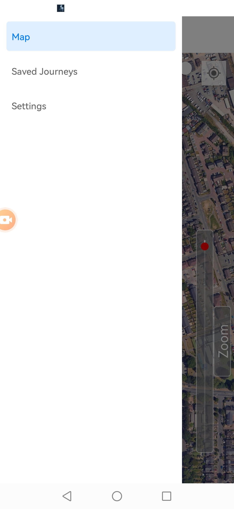
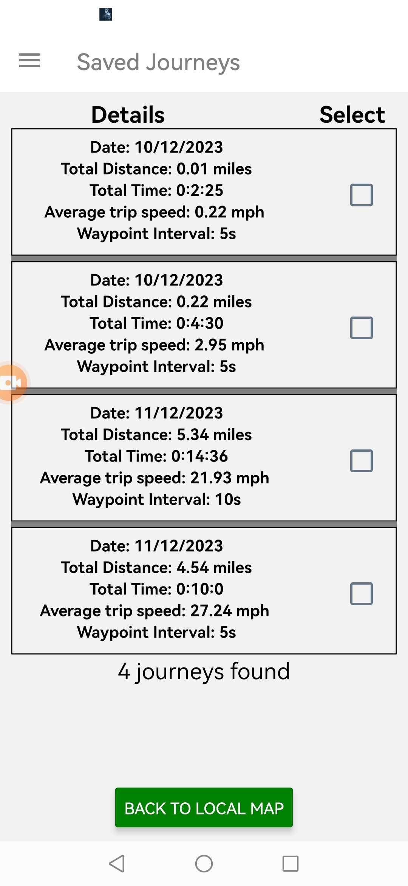
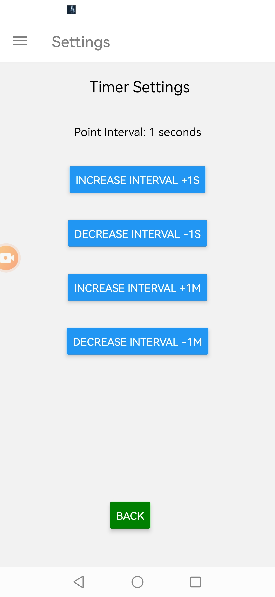
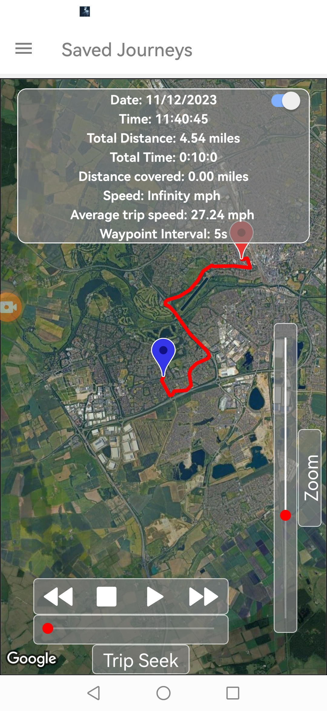
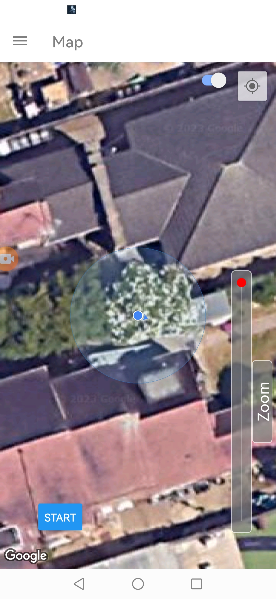

# TrackMe
## Basic fitness tracking app


    

[](https://youtu.be/8Qeuj8PF4dAA)

[Download apk currently unsigned by google play, signed link coming soon](https://expo.dev/artifacts/eas/dyvHtaRLKYrUsDAkXWX285.apk)

Project written using [expo](https://docs.expo.dev/), [React Native](https://reactnative.dev/)

Built using [EAS Build](https://docs.expo.dev/build/introduction/)

[setup eas-cli](https://docs.expo.dev/build/setup/)

clone repo,
``````
git clone https://github.com/Chris-Mark-Wilson/trackme.git
npm install
``````

run a build 
``````
eas build -p android --profile preview
``````
this will give you the app identifier e.g. (com.trackMe)
and an sha1 key (shown in build credentials)

go to https://console.cloud.google.com
create a new project
go to project credentials and input your app identifier and the sha1 key you got from the build credentials
restrict the app to android only
add the google maps sdk
add directions


in app.json add the following code
expo:{....


      "config":{
        "googleMaps":{
          "apiKey":"replace this with your api key"
        }
      }
    }
     this should alleviate any build issues....
     
     build the app again, it should now work..

  Issues with refusal to build or crashing immediately on start are usually google api related and you may find you have to restrict and then de-restrict the app in your api key credentials

